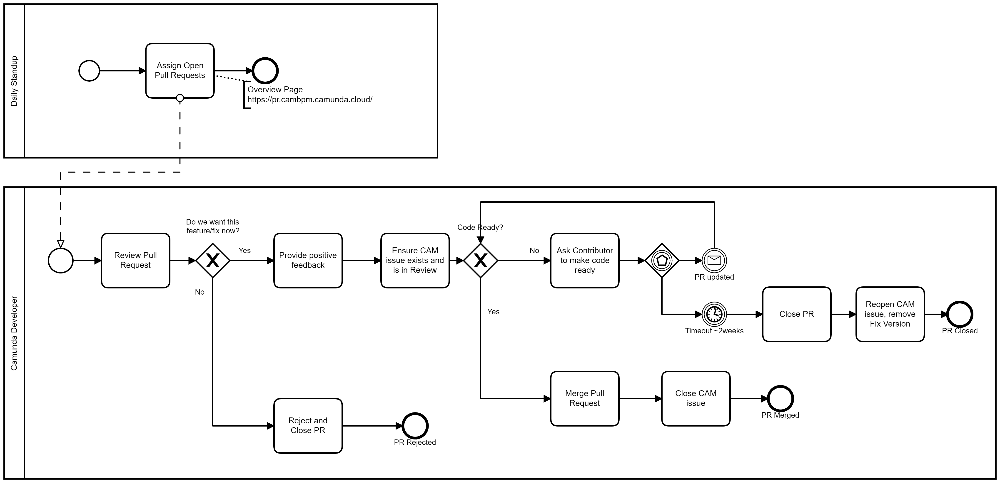

# Introduction

Goals

- All pull requests are worked on.
- Provide fast and transparent feedback to the community.
- We want to help people to write mergeable code.
- A negative decision ("will not merge") is better than no decision at all.

Problems from the past

- Pull requests were forgotten about and never merged
- For some pull requests no decisions were taken and they were never closed / merged.

# Process

The following BPMN diagram shows the process of how we handle pull requests ([Open Full Size](img/pull-requests.png)):

Some Notes:
- Overview of Pull Requests: <https://pr.cambpm.camunda.cloud/> (Camunda Internal only)
- Some Pull requests are exceptional and do not fit the "default-process". They should be treated as exceptions.
- If the code is OK but there are some formal issues we should fix the formal issues ourselves and merge the code. (Example of formal issues: multiple commits, commit message inadequate ...)

